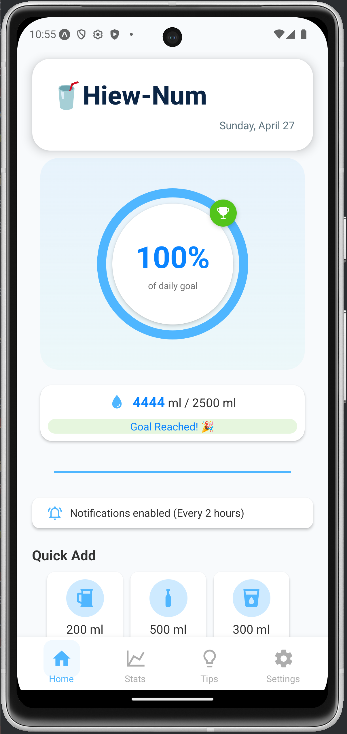
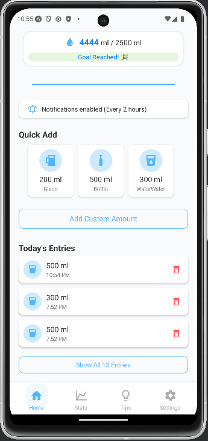
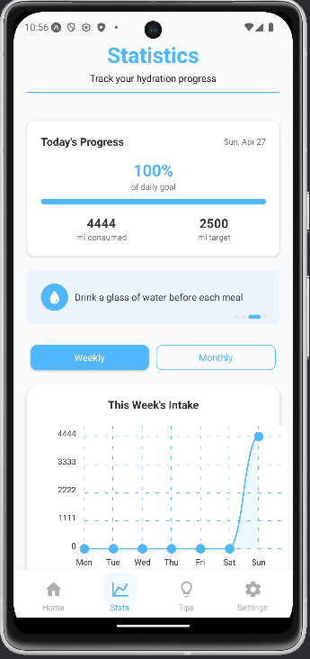
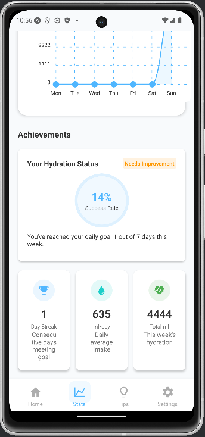
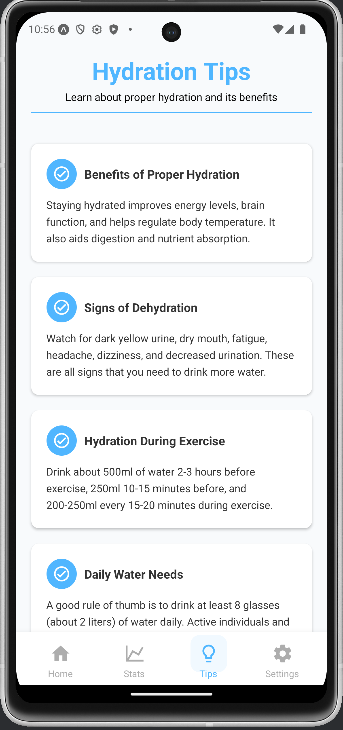
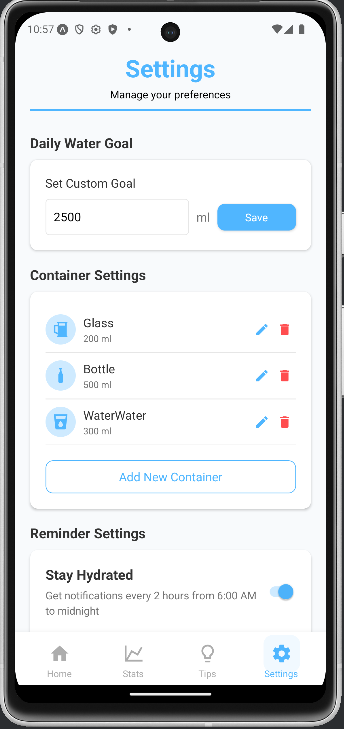

# Take-home Assignment Submission

## ข้อมูลส่วนตัว
- **ชื่อ - นามสกุล (Full Name):** Panaikron Marohabut
- **รหัสนักศึกษา (Student ID):** 6631503126
- **ชื่อแอป (App Name):** Hiew-Num (หิวน้ำ)
- **Framework ที่ใช้:** React Native with Expo
- **ลิงก์ GitHub Repository:** (กรอกที่นี่)
- **ลิงก์ไฟล์ติดตั้ง (APK):** [Google Drive](https://drive.google.com/drive/folders/1yFLliCkzkfb23EmcjzyVI88apgJccd5k?usp=sharing)

---

## 1. การออกแบบแอป | App Concept and Design

### 1.1 ผู้ใช้งานเป้าหมาย | User Personas
- **Persona 1:**  
  - ชื่อ: แทน
  - อายุ: 25 ปี
  - อาชีพ: พนักงานออฟฟิศ
  - ความต้องการ: ต้องการดูแลสุขภาพด้วยการดื่มน้ำให้เพียงพอ แต่มักลืมดื่มน้ำเมื่อทำงาน

- **Persona 2:**  
  - ชื่อ: มิ้นท์
  - อายุ: 22 ปี
  - อาชีพ: นักศึกษา
  - ความต้องการ: อยากติดตามปริมาณน้ำที่ดื่มในแต่ละวัน และต้องการการแจ้งเตือนเป็นระยะ

- **Persona 3:**  
  - ชื่อ: กาย
  - อายุ: 20 ปี
  - อาชีพ: นักศึกษา
  - ความต้องการ: ออกกำลังกายเป็นประจำ และต้องการดื่มน้ำให้ครบตามเกณฑ์ประจำวัน

---

### 1.2 เป้าหมายของแอป | App Goals
- บันทึกและติดตามปริมาณการดื่มน้ำประจำวัน
- แจ้งเตือนการดื่มน้ำเป็นประจำ (ทุกๆ 2 ชั่วโมง ตั้งแต่ 6 โมงเช้าถึงเที่ยงคืน)
- แสดงสถิติการดื่มน้ำรายสัปดาห์ และรายเดือน
- ช่วยให้ผู้ใช้ดื่มน้ำได้ตามเป้าหมาย

---

### 1.3 โครงร่างหน้าจอ | Mockup

#### หน้าหลัก (Home Screen)
  


- แสดงปริมาณน้ำที่ดื่มวันนี้
- Quick Add buttons สำหรับเพิ่มปริมาณน้ำ / กำหนดเอง
- รายการการดื่มน้ำล่าสุด
- สถานะการแจ้งเตือน

#### หน้าสถิติ (Stats Screen)
  


- กราฟรายสัปดาห์และรายเดือน
- ค่าเฉลี่ยและสถิติต่างๆ

#### หน้าเคล็ดลับ (Tips Screen)


- แสดงเคล็ดลับเรื่องการดื่มน้ำ

#### หน้าตั้งค่า (Settings Screen)


- ตั้งเป้าหมายการดื่มน้ำ
- จัดการภาชนะ
- ตั้งค่าการแจ้งเตือน

---

### 1.4 การไหลของผู้ใช้งาน | User Flow

- **Home Flow:**  
  เปิดแอป > ดูเป้าหมายปริมาณน้ำ > Quick Add / กำหนดเอง > ลบปริมาณน้ำ > ดูประวัติ

- **Stats Flow:**  
  เข้า Stats > ดูกราฟรายสัปดาห์หรือรายเดือน

- **Tips Flow:**  
  เข้า Tips > อ่านเคล็ดลับต่าง ๆ

- **Settings Flow:**  
  เข้า Settings > ตั้งเป้าหมายดื่มน้ำ > จัดการภาชนะ > ตั้งค่าการแจ้งเตือน

---

## 2. การพัฒนาแอป | App Implementation

### 2.1 รายละเอียดการพัฒนา | Development Details
- **Framework:** React Native + Expo
- **Packages ที่ใช้:**
  - `expo-notifications`
  - `@react-navigation/bottom-tabs`
  - `moment`
  - `@react-native-async-storage/async-storage`
  - `react-native-safe-area-context`

---

### 2.2 ฟังก์ชันที่พัฒนา | Features Implemented
- [x] บันทึกการดื่มน้ำ, Quick Add, กำหนดเอง, ลบบันทึก, ดูประวัติ
- [x] สถิติรายสัปดาห์และรายเดือน
- [x] แจ้งเตือนการดื่มน้ำอัตโนมัติ (ทุก 2 ชม.)
- [x] เคล็ดลับการดื่มน้ำ
- [x] ตั้งค่าดื่มน้ำ, จัดการภาชนะ, เปิด-ปิดแจ้งเตือน

---

## 3. การ Build และติดตั้งแอป | Deployment

### 3.1 ประเภท Build
- [x] Debug

### 3.2 แพลตฟอร์มที่ทดสอบ
- [x] Android

### 3.3 วิธีติดตั้ง | Install Guide
1. ติดตั้ง dependencies:
    ```bash
    npm install
    ```
2. Build APK:
    ```bash
    eas build -p android --profile preview
    ```
3. ติดตั้ง APK ลงบนอุปกรณ์ Android

---

## 4. การสะท้อนผลลัพธ์ | Reflection

- **ใช้ Context API** จัดการ state (AppContext)
- **ระบบแจ้งเตือน:** ตั้งเวลาทุก 2 ชม. ด้วย `expo-notifications`
- **เก็บข้อมูลด้วย AsyncStorage:** ประวัติการดื่มน้ำ, ตั้งค่าผู้ใช้
- **UI/UX:** 
  - Custom Components (Button.js, ContainerButton.js)
  - Layout เรียบง่าย ใช้งานง่าย

---

## 5. การใช้ AI ช่วยพัฒนา | AI Assisted Development

### 5.1 Idea Generation
- **Prompt:** "Design a water tracking app that helps users stay hydrated"
- **ผลลัพธ์:** ได้ไอเดียแจ้งเตือนอัตโนมัติ และ progress tracking

### 5.2 UI Layout
- **Prompt:** "React Native UI design for water tracking app with progress circle"
- **ผลลัพธ์:** แนวทางออกแบบ WaterProgress component

### 5.3 Debugging
- **Prompt:** "How to implement notifications in Expo React Native app"
- **ผลลัพธ์:** วิธีตั้งค่า `expo-notifications` อย่างถูกต้อง

---
